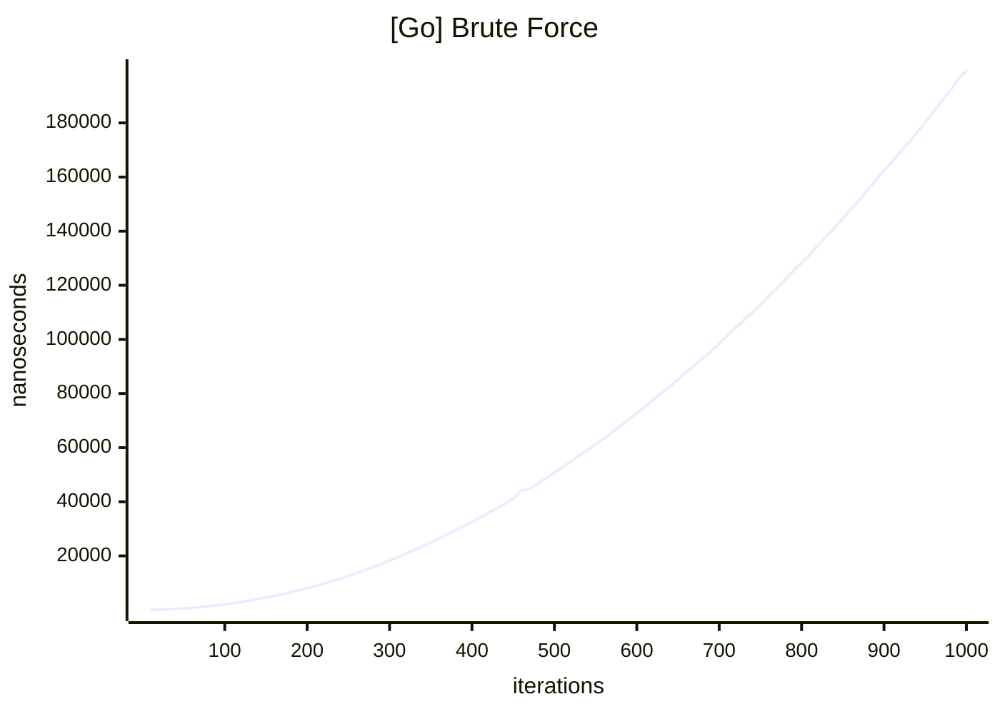
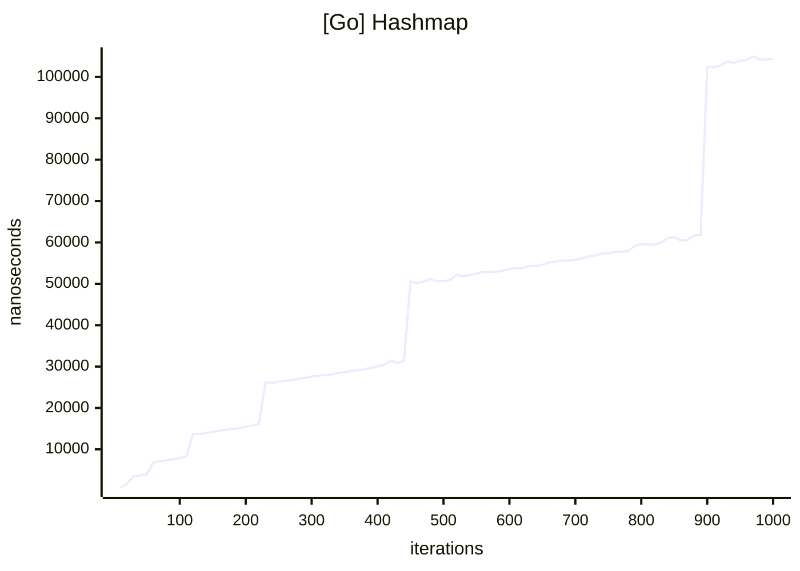
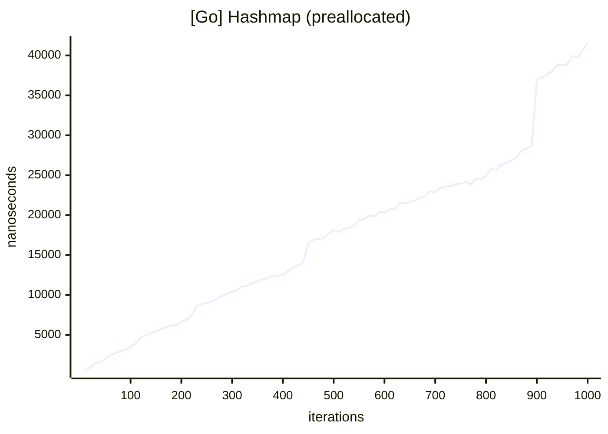
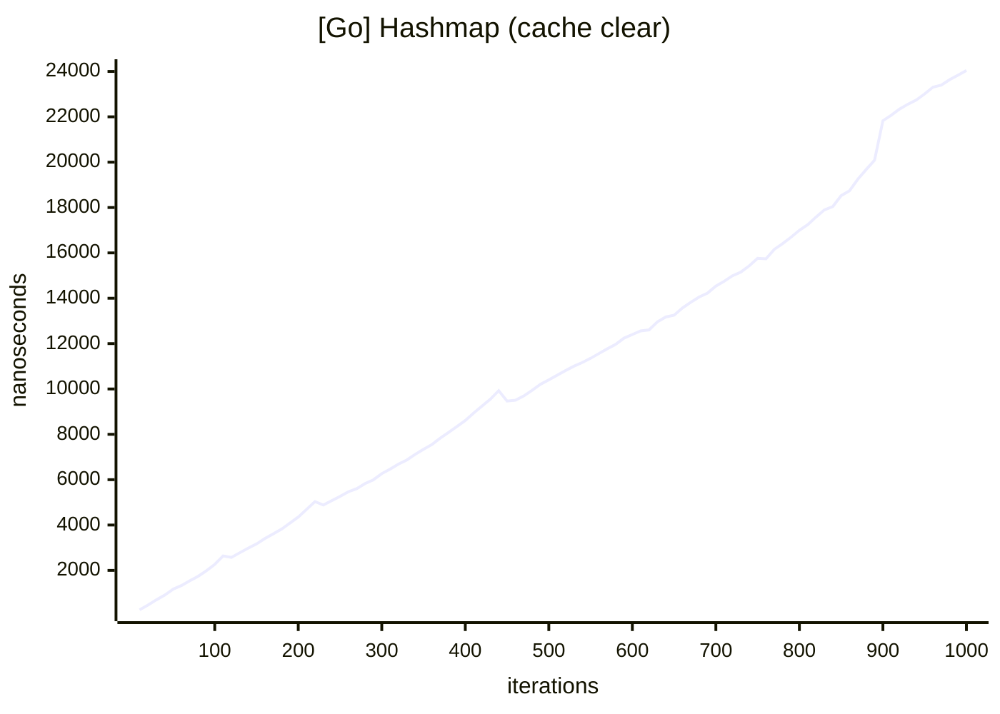
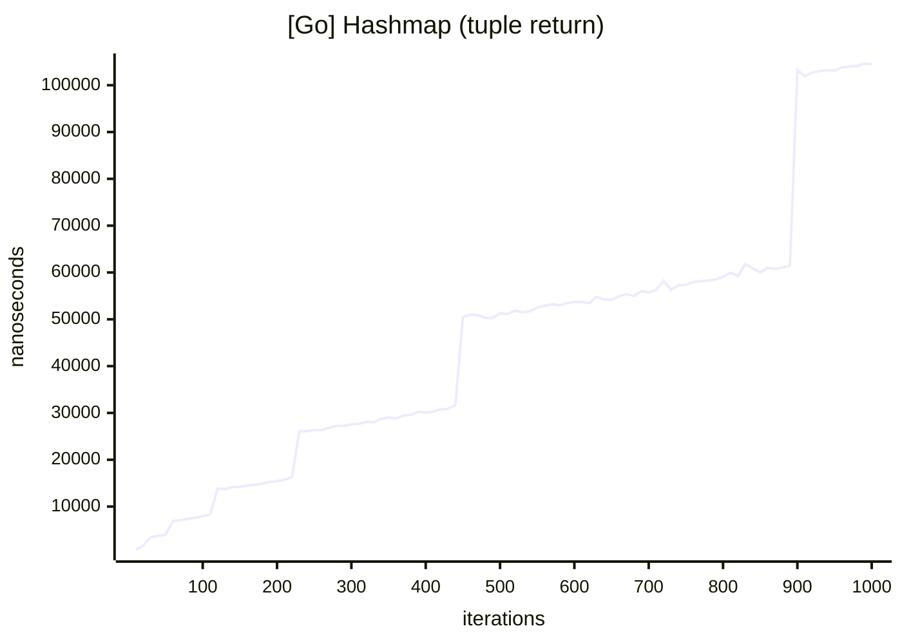
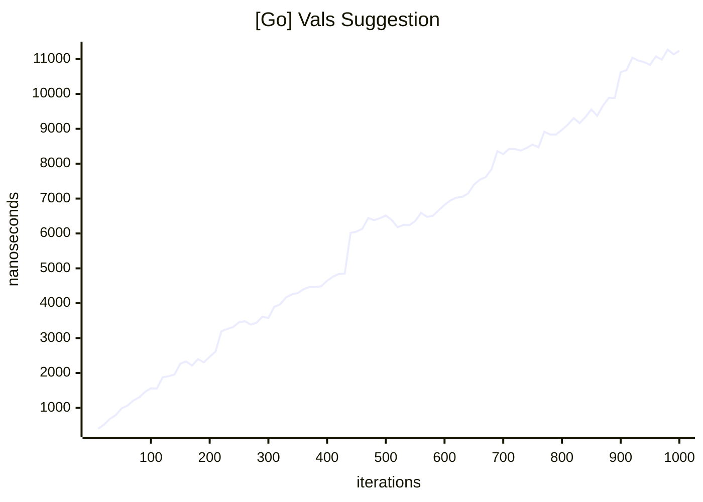

```mermaid
xychart-beta
    title "[Go] Brute Force"
    x-axis "iterations" 10 --> 1000
    y-axis "nanoseconds"

    line [63, 134, 242, 390, 581, 809, 1074, 1381, 1726, 2107, 2531, 2987, 3488, 4023, 4604, 5207, 5871, 6565, 7301, 8062, 8914, 9753, 10660, 11553, 12577, 13635, 14728, 15855, 17028, 18254, 19514, 20794, 22166, 23552, 24963, 26396, 27845, 29442, 30935, 32538, 34111, 35846, 37543, 39304, 41143, 44275, 44796, 46693, 48702, 50816, 52743, 54780, 57100, 58952, 61191, 63287, 65617, 67893, 70357, 72770, 75100, 77653, 80053, 82567, 85167, 87938, 90326, 93070, 95600, 98520, 101373, 104334, 107149, 109867, 112871, 116100, 118903, 122060, 125293, 128305, 131344, 134777, 138026, 141309, 144646, 148155, 151435, 155209, 158870, 162494, 165643, 169473, 172726, 176466, 180333, 183986, 188182, 191773, 196087, 199338]
```

```mermaid
xychart-beta
    title "[Go] Hashmap"
    x-axis "iterations" 10 --> 1000
    y-axis "nanoseconds"

    line [721, 1702, 3475, 3670, 3949, 6920, 7105, 7345, 7604, 7896, 8323, 13674, 13657, 13958, 14204, 14506, 14718, 14962, 15111, 15453, 15728, 16156, 26201, 25976, 26387, 26564, 26745, 26988, 27261, 27576, 27733, 28040, 28081, 28474, 28597, 28963, 29085, 29403, 29657, 30076, 30436, 31440, 30857, 31380, 50576, 50112, 50584, 51210, 50622, 50648, 50920, 52182, 51813, 52149, 52421, 52880, 52816, 52938, 53170, 53644, 53727, 53713, 54282, 54347, 54582, 55168, 55358, 55608, 55638, 55779, 56145, 56663, 56825, 57294, 57441, 57707, 57779, 57911, 59156, 59678, 59483, 59494, 59969, 61112, 61300, 60444, 60593, 61650, 61774, 102351, 102359, 102824, 103689, 103407, 103911, 104128, 104954, 104188, 104214, 104342]
```

```mermaid
xychart-beta
    title "[Go] Hashmap (preallocated)"
    x-axis "iterations" 10 --> 1000
    y-axis "nanoseconds"

    line [530, 881, 1443, 1635, 1946, 2504, 2731, 2971, 3181, 3501, 3905, 4690, 4945, 5254, 5433, 5732, 5954, 6208, 6268, 6620, 6947, 7433, 8628, 8867, 9034, 9162, 9578, 9886, 10157, 10403, 10649, 11076, 11123, 11493, 11725, 11971, 12132, 12445, 12352, 12550, 12982, 13443, 13659, 14174, 16459, 16910, 17017, 17127, 17695, 18156, 17906, 18321, 18404, 18655, 19376, 19517, 19942, 19882, 20453, 20321, 20724, 20753, 21550, 21446, 21710, 21802, 22205, 22314, 23013, 22870, 23430, 23596, 23623, 23878, 23939, 24161, 23863, 24548, 24451, 24908, 25817, 25628, 26333, 26564, 26830, 27268, 28065, 28324, 28691, 36944, 37183, 37601, 38030, 38790, 38806, 38902, 39931, 39734, 40630, 41566]
```

```mermaid
xychart-beta
    title "[Go] Hashmap (cache clear)"
    x-axis "iterations" 10 --> 1000
    y-axis "nanoseconds"

    line [261, 471, 700, 910, 1168, 1331, 1539, 1737, 1985, 2265, 2641, 2572, 2779, 2979, 3166, 3405, 3611, 3822, 4085, 4352, 4693, 5034, 4882, 5073, 5263, 5469, 5603, 5828, 5996, 6267, 6466, 6689, 6869, 7115, 7338, 7549, 7831, 8086, 8347, 8609, 8939, 9246, 9548, 9926, 9468, 9506, 9690, 9941, 10208, 10401, 10606, 10808, 11003, 11163, 11350, 11564, 11770, 11968, 12241, 12402, 12559, 12605, 12956, 13173, 13251, 13573, 13822, 14054, 14227, 14536, 14749, 14992, 15157, 15430, 15758, 15739, 16159, 16413, 16689, 16995, 17242, 17583, 17899, 18043, 18523, 18739, 19247, 19677, 20090, 21827, 22069, 22343, 22557, 22739, 23009, 23308, 23401, 23638, 23835, 24038]
```

```mermaid
xychart-beta
    title "[Go] Hashmap (tuple return)"
    x-axis "iterations" 10 --> 1000
    y-axis "nanoseconds"

    line [710, 1699, 3441, 3735, 3958, 6912, 7107, 7367, 7601, 7933, 8338, 13857, 13713, 14133, 14215, 14478, 14652, 14860, 15250, 15419, 15745, 16231, 26116, 26116, 26342, 26384, 26814, 27226, 27221, 27575, 27691, 28089, 28000, 28721, 29018, 28823, 29465, 29608, 30247, 30076, 30287, 30766, 30883, 31704, 50483, 50952, 50905, 50299, 50297, 51265, 51136, 51849, 51502, 51727, 52511, 52896, 53209, 53004, 53423, 53679, 53732, 53436, 54786, 54229, 54132, 54925, 55365, 55006, 56019, 55734, 56283, 58250, 56288, 57267, 57349, 57955, 58149, 58248, 58514, 59063, 59944, 59258, 61805, 60898, 60017, 61012, 60770, 61069, 61461, 103224, 101904, 102720, 103023, 103224, 103097, 103848, 103968, 104117, 104603, 104480]
```

```mermaid
xychart-beta
    title "[Go] Vals Suggestion"
    x-axis "iterations" 10 --> 1000
    y-axis "nanoseconds"

    line [401, 518, 684, 791, 986, 1065, 1212, 1302, 1458, 1560, 1554, 1878, 1908, 1955, 2267, 2327, 2214, 2397, 2307, 2464, 2615, 3194, 3263, 3317, 3452, 3483, 3387, 3444, 3614, 3574, 3896, 3966, 4166, 4254, 4290, 4398, 4464, 4463, 4485, 4642, 4761, 4840, 4847, 6017, 6053, 6134, 6440, 6383, 6437, 6514, 6387, 6178, 6244, 6238, 6355, 6592, 6477, 6507, 6664, 6821, 6948, 7026, 7048, 7144, 7399, 7540, 7615, 7842, 8358, 8275, 8425, 8419, 8376, 8450, 8548, 8472, 8917, 8836, 8836, 8973, 9118, 9307, 9162, 9337, 9556, 9373, 9669, 9889, 9885, 10624, 10678, 11040, 10955, 10910, 10833, 11075, 10983, 11270, 11137, 11235]
```
