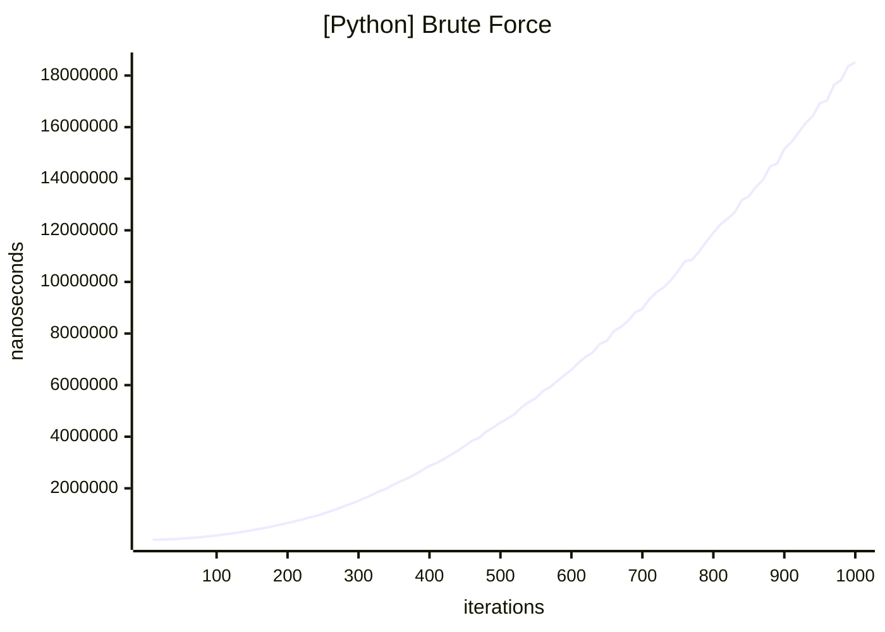
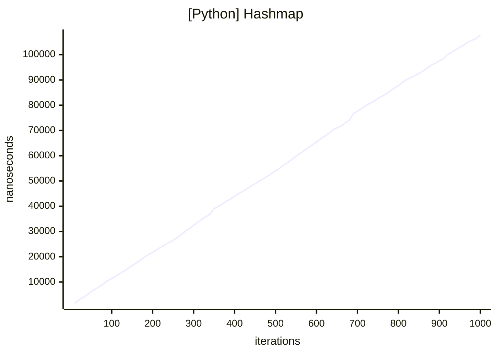
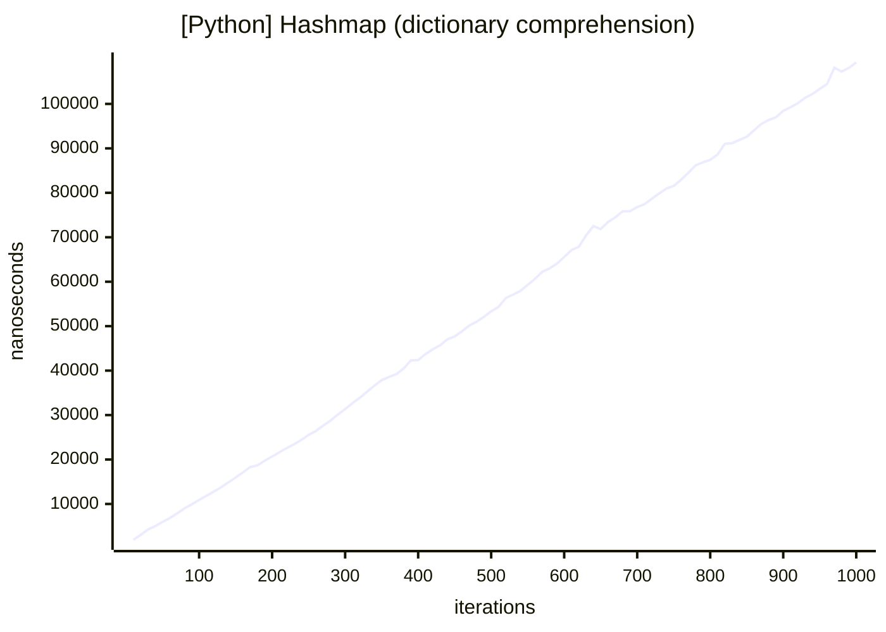
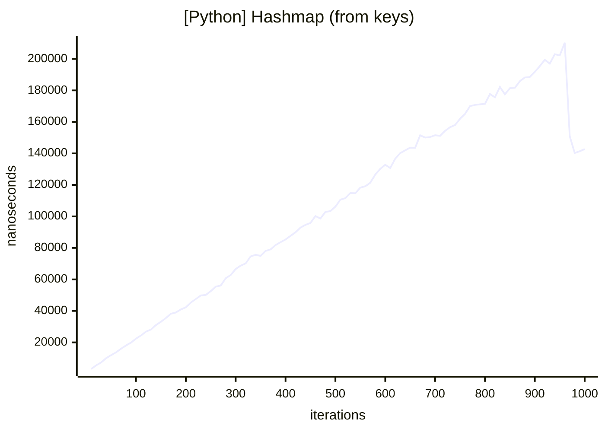
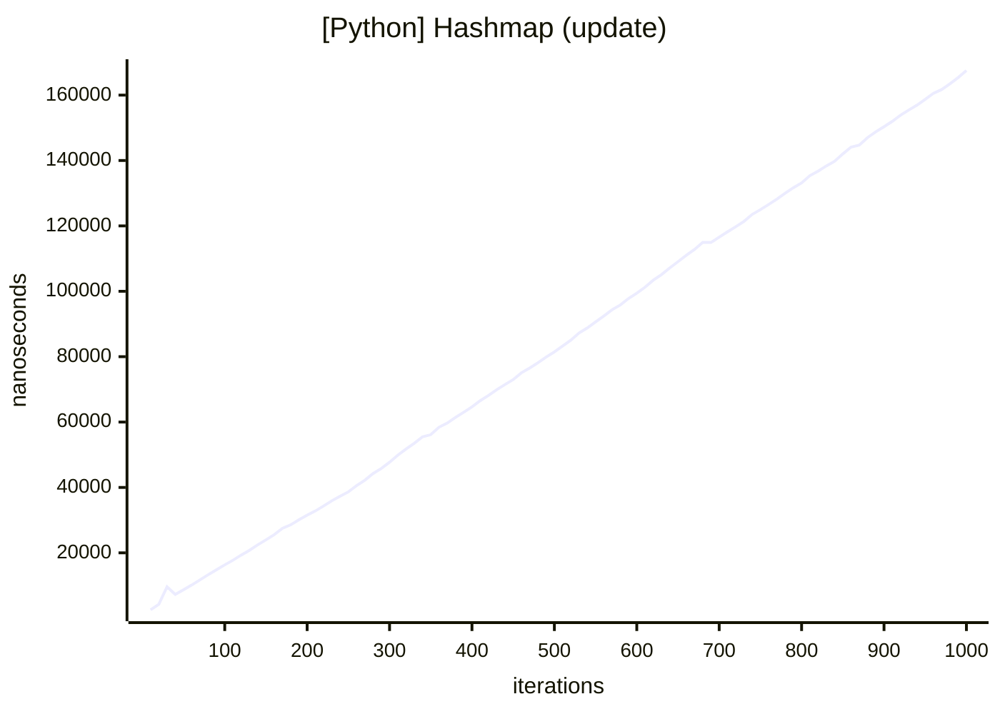
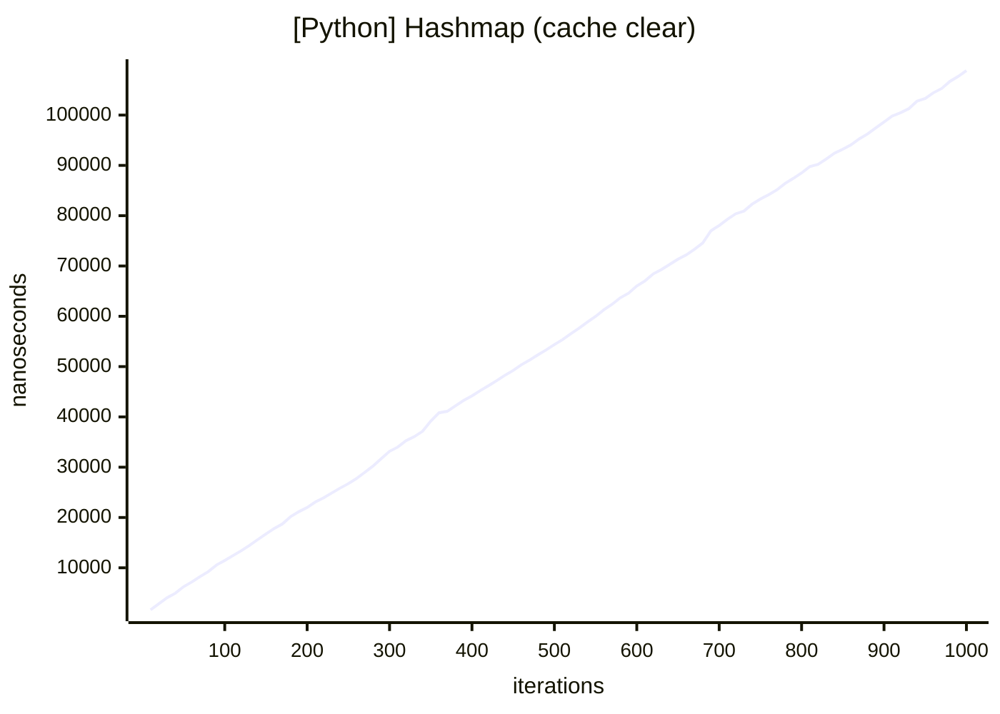
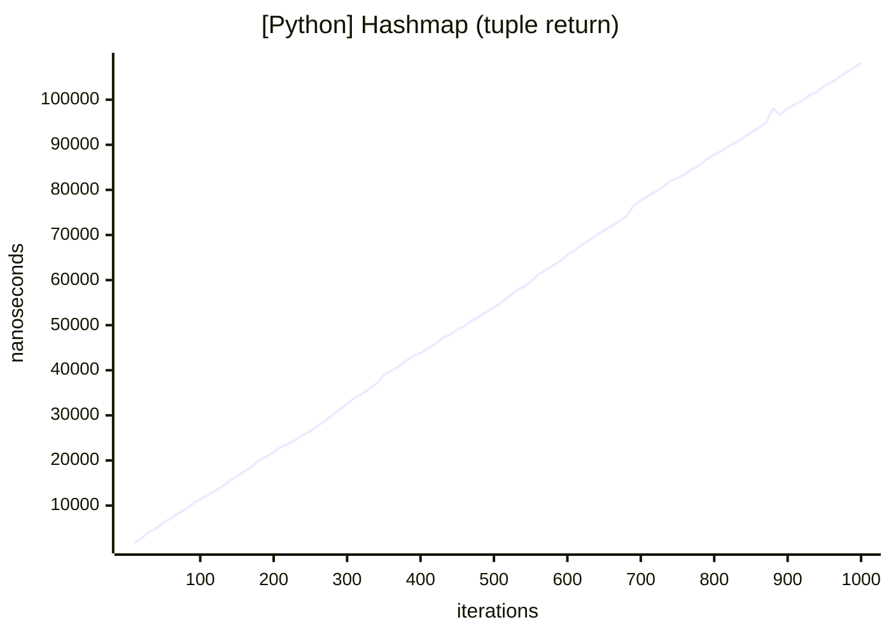
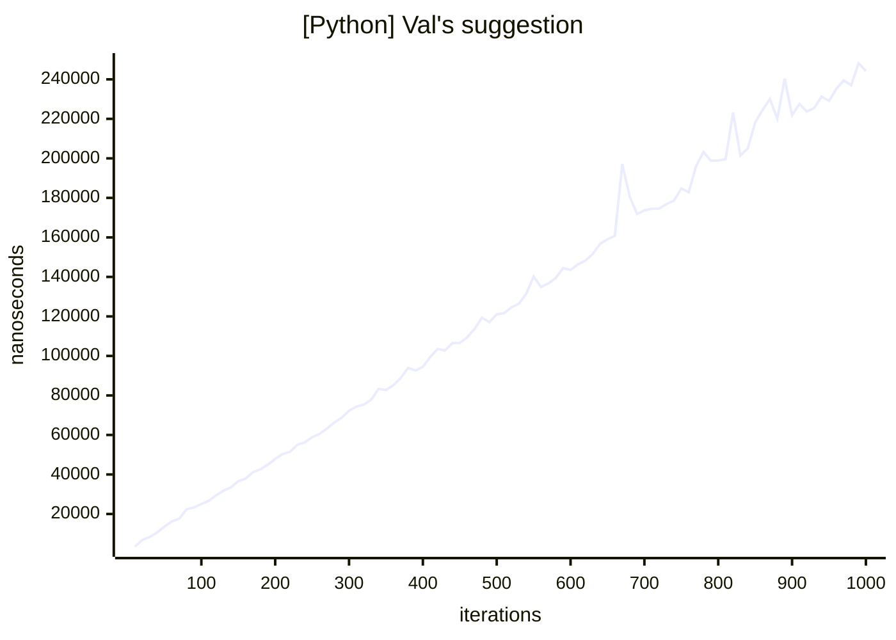

```mermaid
xychart-beta
    title "[Python] Brute Force"
    x-axis "iterations" 10 --> 1000
    y-axis "nanoseconds"

    line [4041, 11507, 19578, 31978, 48040, 66342, 87982, 113226, 141862, 171884, 207907, 244302, 286529, 326551, 376466, 422632, 476458, 535279, 595232, 655895, 718205, 780991, 865129, 926814, 1015479, 1104634, 1197792, 1308087, 1408467, 1515871, 1634337, 1760289, 1889496, 1997579, 2148969, 2285924, 2395276, 2543580, 2709688, 2868030, 2975600, 3129073, 3295737, 3457184, 3651085, 3842209, 3958543, 4200499, 4358340, 4553122, 4706794, 4875898, 5147133, 5340670, 5497817, 5772960, 5923092, 6156185, 6383159, 6589632, 6866112, 7094839, 7268404, 7597067, 7719123, 8096226, 8261885, 8496812, 8819013, 8954966, 9339787, 9601298, 9786468, 10066060, 10409632, 10798281, 10855539, 11176244, 11558334, 11906672, 12226068, 12447802, 12693514, 13166444, 13313960, 13682690, 13962954, 14477178, 14590655, 15156450, 15421691, 15780296, 16162722, 16429044, 16923010, 17025922, 17630922, 17826417, 18364198, 18506079]
```

```mermaid
xychart-beta
    title "[Python] Hashmap"
    x-axis "iterations" 10 --> 1000
    y-axis "nanoseconds"

    line [1604, 2868, 3894, 4939, 6226, 7157, 8220, 9232, 10494, 11453, 12352, 13278, 14282, 15416, 16538, 17575, 18583, 19947, 20873, 21751, 22828, 23763, 24751, 25605, 26548, 27554, 28812, 30133, 31176, 32470, 33739, 34816, 35814, 36874, 39014, 39957, 40821, 41930, 42884, 43967, 44978, 45891, 46912, 47911, 48907, 49896, 50946, 51801, 53038, 54030, 55027, 56388, 57299, 58556, 59767, 60931, 62028, 63223, 64342, 65467, 66680, 67716, 68865, 70270, 71073, 71712, 73012, 73969, 76705, 77639, 78679, 79752, 80757, 81473, 82749, 83532, 84525, 85546, 86822, 87712, 89012, 90185, 90910, 91665, 92591, 93489, 94749, 95804, 96647, 97627, 98373, 100168, 100868, 101932, 102948, 103856, 105052, 105710, 106408, 107770]
```

```mermaid
xychart-beta
    title "[Python] Hashmap (dictionary comprehension)"
    x-axis "iterations" 10 --> 1000
    y-axis "nanoseconds"

    line [1938, 3051, 4254, 5006, 5976, 6826, 7891, 9018, 9925, 10898, 11838, 12759, 13739, 14852, 15950, 17097, 18310, 18721, 19742, 20671, 21627, 22583, 23425, 24395, 25529, 26416, 27637, 28772, 30095, 31354, 32667, 33882, 35242, 36610, 37843, 38570, 39199, 40453, 42311, 42359, 43714, 44785, 45686, 47046, 47672, 48870, 50122, 51002, 52105, 53317, 54317, 56330, 57076, 57920, 59305, 60630, 62237, 62989, 64048, 65568, 67117, 67860, 70415, 72513, 71838, 73414, 74472, 75834, 75851, 76789, 77449, 78643, 79841, 80958, 81530, 82938, 84493, 86184, 86857, 87424, 88614, 91008, 91164, 91900, 92593, 94050, 95496, 96375, 97004, 98424, 99232, 100158, 101397, 102220, 103391, 104470, 108150, 107277, 108111, 109321]
```

```mermaid
xychart-beta
    title "[Python] Hashmap (from keys)"
    x-axis "iterations" 10 --> 1000
    y-axis "nanoseconds"

    line [3127, 5409, 7229, 9962, 11890, 13690, 15966, 18027, 19891, 22376, 24348, 26813, 28149, 30992, 33092, 35451, 38163, 39006, 40907, 42259, 45271, 47526, 49836, 50105, 52534, 55413, 56097, 60695, 62795, 66580, 68747, 70142, 74579, 75620, 74950, 78104, 79047, 81779, 83628, 85323, 87589, 89925, 92899, 94631, 95826, 100188, 98674, 102842, 103344, 106192, 110640, 111580, 114821, 114733, 118284, 119124, 121433, 126523, 130207, 132764, 130689, 136652, 140162, 141920, 143675, 143606, 151480, 150071, 150396, 151526, 151142, 154332, 156618, 158015, 161981, 165078, 170020, 170785, 171137, 171447, 177672, 175624, 182194, 177501, 181392, 181701, 185824, 188183, 188532, 191768, 195430, 199384, 197024, 202958, 202214, 210275, 150977, 140232, 141372, 142729]
```

```mermaid
xychart-beta
    title "[Python] Hashmap (update)"
    x-axis "iterations" 10 --> 1000
    y-axis "nanoseconds"

    line [2562, 4247, 9610, 7271, 8684, 10164, 11735, 13310, 14828, 16312, 17743, 19307, 20780, 22434, 23971, 25554, 27500, 28555, 30099, 31502, 32818, 34334, 35929, 37327, 38642, 40552, 42215, 44255, 45810, 47696, 49872, 51739, 53500, 55496, 56131, 58430, 59673, 61409, 63012, 64639, 66522, 68110, 69894, 71474, 72976, 75067, 76511, 78108, 79860, 81460, 83268, 85035, 87274, 88785, 90641, 92442, 94350, 95817, 97802, 99435, 101233, 103387, 105106, 107149, 109045, 110989, 112777, 114953, 114928, 116565, 118166, 119714, 121379, 123507, 124957, 126542, 128203, 129973, 131664, 133142, 135345, 136750, 138332, 139739, 142005, 144093, 144721, 147004, 148765, 150325, 151965, 153837, 155438, 156936, 158705, 160554, 161706, 163447, 165372, 167504]
```

```mermaid
xychart-beta
    title "[Python] Hashmap (cache clear)"
    x-axis "iterations" 10 --> 1000
    y-axis "nanoseconds"

    line [1641, 2854, 4049, 4942, 6232, 7181, 8248, 9234, 10549, 11460, 12422, 13385, 14459, 15604, 16731, 17811, 18720, 20172, 21160, 21975, 23083, 23900, 24881, 25844, 26725, 27765, 28979, 30237, 31703, 33158, 33995, 35258, 36061, 37136, 39150, 40808, 41115, 42197, 43283, 44172, 45226, 46202, 47210, 48264, 49225, 50369, 51295, 52337, 53315, 54362, 55376, 56541, 57629, 58843, 59969, 61294, 62382, 63680, 64590, 66025, 67041, 68430, 69298, 70320, 71345, 72196, 73316, 74577, 77001, 78051, 79295, 80374, 80918, 82301, 83319, 84179, 85129, 86424, 87425, 88500, 89766, 90221, 91287, 92438, 93216, 94086, 95275, 96239, 97456, 98615, 99813, 100469, 101258, 102764, 103299, 104449, 105288, 106707, 107687, 108848]
```

```mermaid
xychart-beta
    title "[Python] Hashmap (tuple return)"
    x-axis "iterations" 10 --> 1000
    y-axis "nanoseconds"

    line [1649, 2751, 4149, 4929, 6222, 7139, 8270, 9184, 10436, 11380, 12318, 13252, 14250, 15452, 16476, 17566, 18566, 20000, 20862, 21841, 23012, 23664, 24601, 25642, 26517, 27709, 28785, 30094, 31316, 32577, 33862, 34738, 35859, 37035, 38936, 39906, 40793, 42055, 43137, 43785, 44836, 45863, 47135, 47894, 49066, 49790, 51034, 51920, 52933, 53970, 54966, 56336, 57606, 58523, 59603, 61153, 62213, 63193, 64183, 65653, 66507, 67879, 68869, 69969, 71031, 71952, 72995, 74078, 76457, 77696, 78630, 79605, 80609, 81989, 82558, 83471, 84667, 85492, 86812, 87798, 88625, 89757, 90573, 91619, 92700, 93660, 94808, 98010, 96693, 98060, 98986, 99776, 101044, 101674, 103104, 103789, 104972, 106088, 107051, 108164]
```

```mermaid
xychart-beta
    title "[Python] Val's suggestion"
    x-axis "iterations" 10 --> 1000
    y-axis "nanoseconds"

    line [3473, 6842, 8355, 10613, 13572, 16230, 17647, 22409, 23308, 25038, 26675, 29422, 31826, 33457, 36542, 37902, 41204, 42609, 44964, 47830, 50401, 51423, 55055, 56250, 58854, 60519, 63221, 66210, 68708, 72248, 74328, 75343, 77838, 83344, 82732, 85146, 88788, 93958, 92641, 94449, 99470, 103505, 102792, 106499, 106616, 109395, 113680, 119369, 117115, 121057, 121636, 124640, 126391, 131500, 140199, 134904, 136698, 139472, 144503, 143523, 146360, 148230, 151581, 156755, 159054, 160807, 197204, 180799, 171856, 173669, 174494, 174583, 176897, 178590, 184760, 182908, 196065, 203193, 198816, 198943, 199618, 223245, 201420, 205064, 218086, 224486, 230028, 219999, 240357, 221791, 227552, 223680, 225471, 231239, 229104, 235245, 239480, 236996, 248135, 244276]
```
