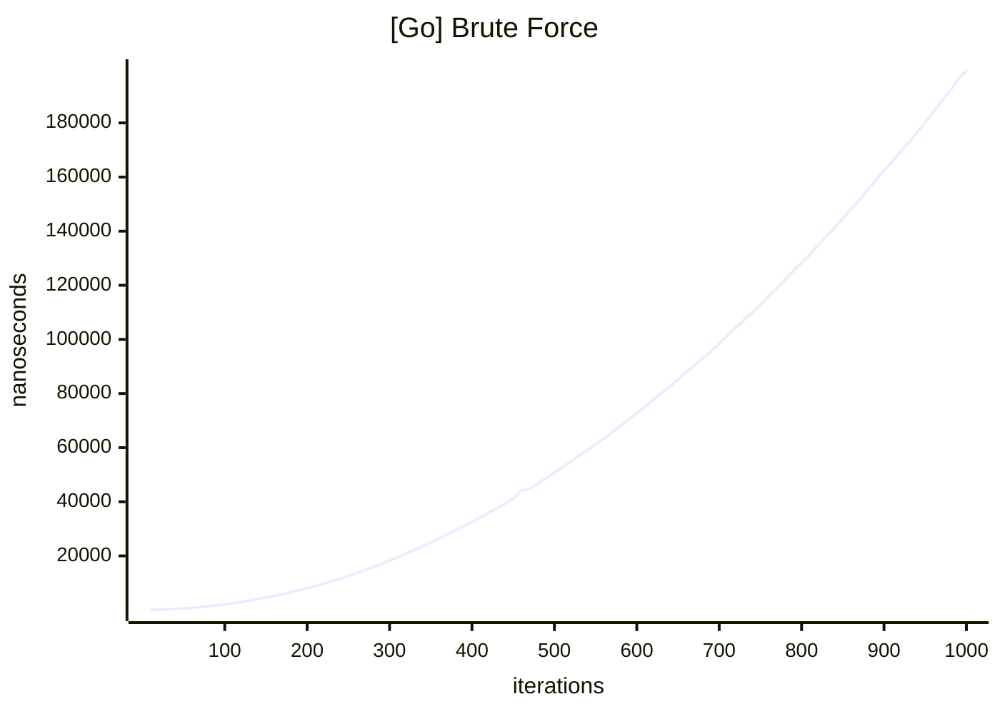
```mermaid
xychart-beta
    title "[Go] Brute Force"
    x-axis "iterations" 10 --> 1000
    y-axis "nanoseconds"

    line [63, 134, 242, 390, 581, 809, 1074, 1381, 1726, 2107, 2531, 2987, 3488, 4023, 4604, 5207, 5871, 6565, 7301, 8062, 8914, 9753, 10660, 11553, 12577, 13635, 14728, 15855, 17028, 18254, 19514, 20794, 22166, 23552, 24963, 26396, 27845, 29442, 30935, 32538, 34111, 35846, 37543, 39304, 41143, 44275, 44796, 46693, 48702, 50816, 52743, 54780, 57100, 58952, 61191, 63287, 65617, 67893, 70357, 72770, 75100, 77653, 80053, 82567, 85167, 87938, 90326, 93070, 95600, 98520, 101373, 104334, 107149, 109867, 112871, 116100, 118903, 122060, 125293, 128305, 131344, 134777, 138026, 141309, 144646, 148155, 151435, 155209, 158870, 162494, 165643, 169473, 172726, 176466, 180333, 183986, 188182, 191773, 196087, 199338]
```

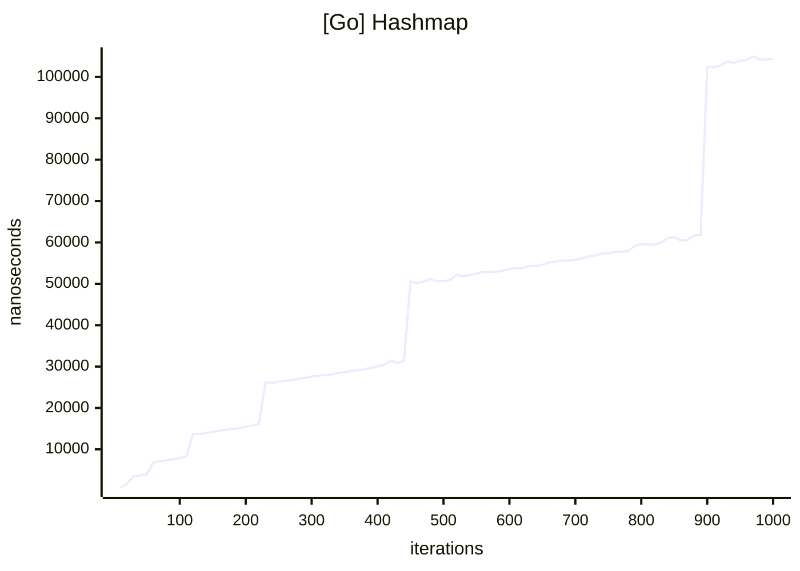
```mermaid
xychart-beta
    title "[Go] Hashmap"
    x-axis "iterations" 10 --> 1000
    y-axis "nanoseconds"

    line [721, 1702, 3475, 3670, 3949, 6920, 7105, 7345, 7604, 7896, 8323, 13674, 13657, 13958, 14204, 14506, 14718, 14962, 15111, 15453, 15728, 16156, 26201, 25976, 26387, 26564, 26745, 26988, 27261, 27576, 27733, 28040, 28081, 28474, 28597, 28963, 29085, 29403, 29657, 30076, 30436, 31440, 30857, 31380, 50576, 50112, 50584, 51210, 50622, 50648, 50920, 52182, 51813, 52149, 52421, 52880, 52816, 52938, 53170, 53644, 53727, 53713, 54282, 54347, 54582, 55168, 55358, 55608, 55638, 55779, 56145, 56663, 56825, 57294, 57441, 57707, 57779, 57911, 59156, 59678, 59483, 59494, 59969, 61112, 61300, 60444, 60593, 61650, 61774, 102351, 102359, 102824, 103689, 103407, 103911, 104128, 104954, 104188, 104214, 104342]
```

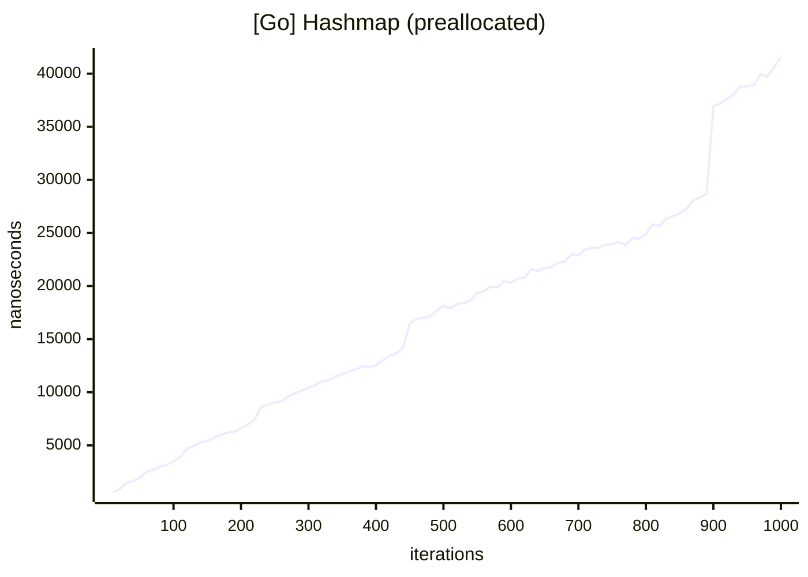
```mermaid
xychart-beta
    title "[Go] Hashmap (preallocated)"
    x-axis "iterations" 10 --> 1000
    y-axis "nanoseconds"

    line [530, 881, 1443, 1635, 1946, 2504, 2731, 2971, 3181, 3501, 3905, 4690, 4945, 5254, 5433, 5732, 5954, 6208, 6268, 6620, 6947, 7433, 8628, 8867, 9034, 9162, 9578, 9886, 10157, 10403, 10649, 11076, 11123, 11493, 11725, 11971, 12132, 12445, 12352, 12550, 12982, 13443, 13659, 14174, 16459, 16910, 17017, 17127, 17695, 18156, 17906, 18321, 18404, 18655, 19376, 19517, 19942, 19882, 20453, 20321, 20724, 20753, 21550, 21446, 21710, 21802, 22205, 22314, 23013, 22870, 23430, 23596, 23623, 23878, 23939, 24161, 23863, 24548, 24451, 24908, 25817, 25628, 26333, 26564, 26830, 27268, 28065, 28324, 28691, 36944, 37183, 37601, 38030, 38790, 38806, 38902, 39931, 39734, 40630, 41566]
```

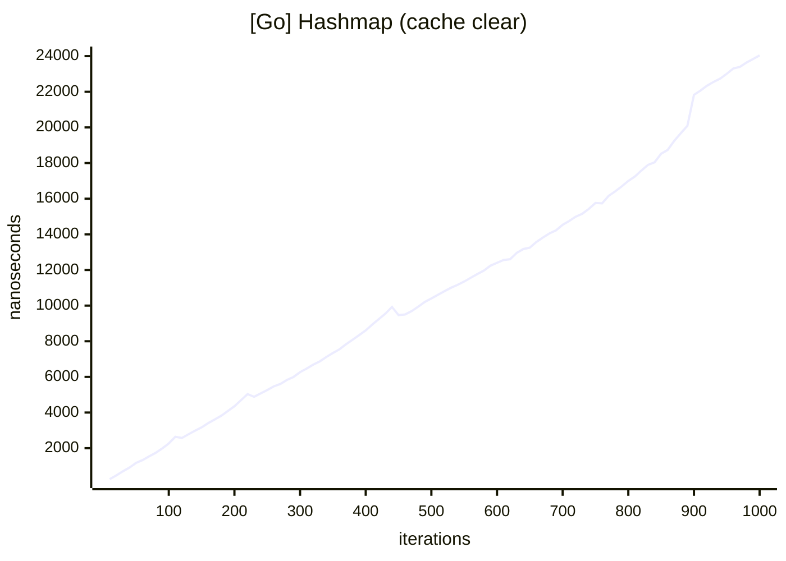
```mermaid
xychart-beta
    title "[Go] Hashmap (cache clear)"
    x-axis "iterations" 10 --> 1000
    y-axis "nanoseconds"

    line [261, 471, 700, 910, 1168, 1331, 1539, 1737, 1985, 2265, 2641, 2572, 2779, 2979, 3166, 3405, 3611, 3822, 4085, 4352, 4693, 5034, 4882, 5073, 5263, 5469, 5603, 5828, 5996, 6267, 6466, 6689, 6869, 7115, 7338, 7549, 7831, 8086, 8347, 8609, 8939, 9246, 9548, 9926, 9468, 9506, 9690, 9941, 10208, 10401, 10606, 10808, 11003, 11163, 11350, 11564, 11770, 11968, 12241, 12402, 12559, 12605, 12956, 13173, 13251, 13573, 13822, 14054, 14227, 14536, 14749, 14992, 15157, 15430, 15758, 15739, 16159, 16413, 16689, 16995, 17242, 17583, 17899, 18043, 18523, 18739, 19247, 19677, 20090, 21827, 22069, 22343, 22557, 22739, 23009, 23308, 23401, 23638, 23835, 24038]
```

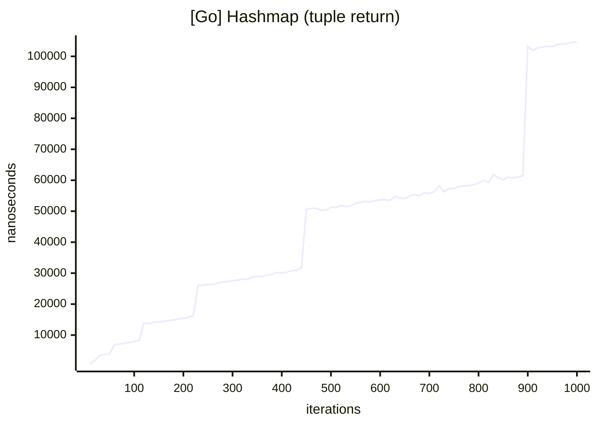
```mermaid
xychart-beta
    title "[Go] Hashmap (tuple return)"
    x-axis "iterations" 10 --> 1000
    y-axis "nanoseconds"

    line [710, 1699, 3441, 3735, 3958, 6912, 7107, 7367, 7601, 7933, 8338, 13857, 13713, 14133, 14215, 14478, 14652, 14860, 15250, 15419, 15745, 16231, 26116, 26116, 26342, 26384, 26814, 27226, 27221, 27575, 27691, 28089, 28000, 28721, 29018, 28823, 29465, 29608, 30247, 30076, 30287, 30766, 30883, 31704, 50483, 50952, 50905, 50299, 50297, 51265, 51136, 51849, 51502, 51727, 52511, 52896, 53209, 53004, 53423, 53679, 53732, 53436, 54786, 54229, 54132, 54925, 55365, 55006, 56019, 55734, 56283, 58250, 56288, 57267, 57349, 57955, 58149, 58248, 58514, 59063, 59944, 59258, 61805, 60898, 60017, 61012, 60770, 61069, 61461, 103224, 101904, 102720, 103023, 103224, 103097, 103848, 103968, 104117, 104603, 104480]
```

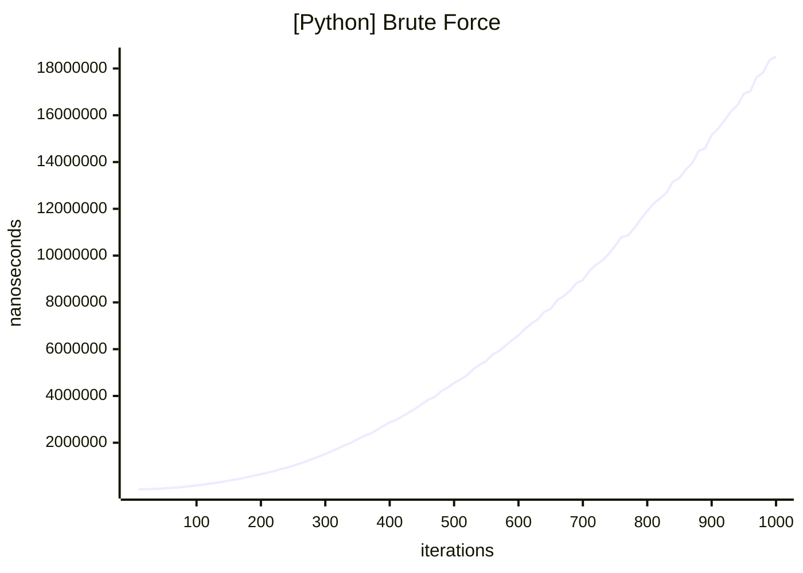
```mermaid
xychart-beta
    title "[Python] Brute Force"
    x-axis "iterations" 10 --> 1000
    y-axis "nanoseconds"

    line [4041, 11507, 19578, 31978, 48040, 66342, 87982, 113226, 141862, 171884, 207907, 244302, 286529, 326551, 376466, 422632, 476458, 535279, 595232, 655895, 718205, 780991, 865129, 926814, 1015479, 1104634, 1197792, 1308087, 1408467, 1515871, 1634337, 1760289, 1889496, 1997579, 2148969, 2285924, 2395276, 2543580, 2709688, 2868030, 2975600, 3129073, 3295737, 3457184, 3651085, 3842209, 3958543, 4200499, 4358340, 4553122, 4706794, 4875898, 5147133, 5340670, 5497817, 5772960, 5923092, 6156185, 6383159, 6589632, 6866112, 7094839, 7268404, 7597067, 7719123, 8096226, 8261885, 8496812, 8819013, 8954966, 9339787, 9601298, 9786468, 10066060, 10409632, 10798281, 10855539, 11176244, 11558334, 11906672, 12226068, 12447802, 12693514, 13166444, 13313960, 13682690, 13962954, 14477178, 14590655, 15156450, 15421691, 15780296, 16162722, 16429044, 16923010, 17025922, 17630922, 17826417, 18364198, 18506079]
```

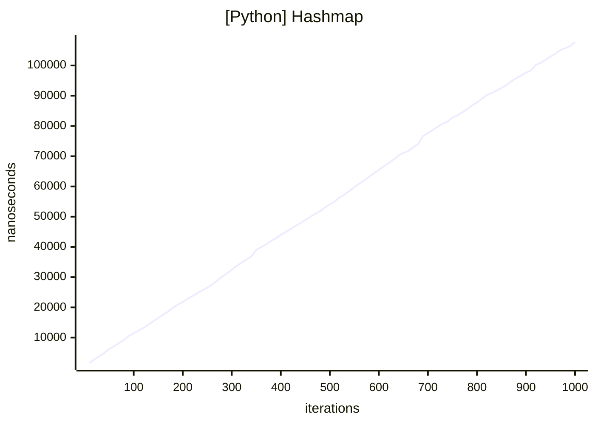
```mermaid
xychart-beta
    title "[Python] Hashmap"
    x-axis "iterations" 10 --> 1000
    y-axis "nanoseconds"

    line [1604, 2868, 3894, 4939, 6226, 7157, 8220, 9232, 10494, 11453, 12352, 13278, 14282, 15416, 16538, 17575, 18583, 19947, 20873, 21751, 22828, 23763, 24751, 25605, 26548, 27554, 28812, 30133, 31176, 32470, 33739, 34816, 35814, 36874, 39014, 39957, 40821, 41930, 42884, 43967, 44978, 45891, 46912, 47911, 48907, 49896, 50946, 51801, 53038, 54030, 55027, 56388, 57299, 58556, 59767, 60931, 62028, 63223, 64342, 65467, 66680, 67716, 68865, 70270, 71073, 71712, 73012, 73969, 76705, 77639, 78679, 79752, 80757, 81473, 82749, 83532, 84525, 85546, 86822, 87712, 89012, 90185, 90910, 91665, 92591, 93489, 94749, 95804, 96647, 97627, 98373, 100168, 100868, 101932, 102948, 103856, 105052, 105710, 106408, 107770]
```

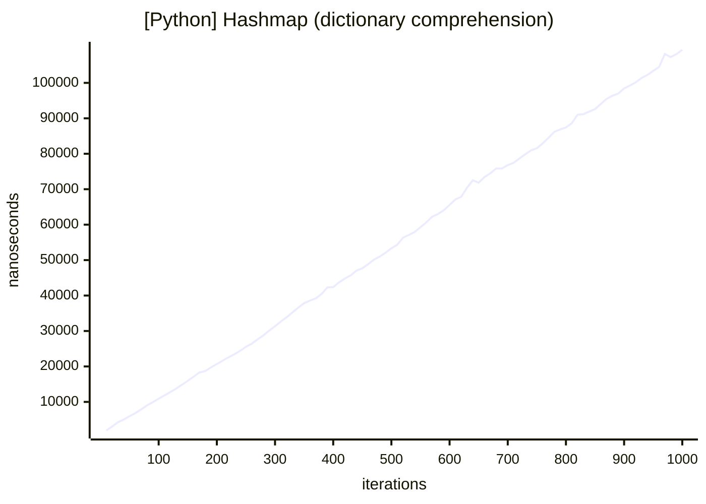
```mermaid
xychart-beta
    title "[Python] Hashmap (dictionary comprehension)"
    x-axis "iterations" 10 --> 1000
    y-axis "nanoseconds"

    line [1938, 3051, 4254, 5006, 5976, 6826, 7891, 9018, 9925, 10898, 11838, 12759, 13739, 14852, 15950, 17097, 18310, 18721, 19742, 20671, 21627, 22583, 23425, 24395, 25529, 26416, 27637, 28772, 30095, 31354, 32667, 33882, 35242, 36610, 37843, 38570, 39199, 40453, 42311, 42359, 43714, 44785, 45686, 47046, 47672, 48870, 50122, 51002, 52105, 53317, 54317, 56330, 57076, 57920, 59305, 60630, 62237, 62989, 64048, 65568, 67117, 67860, 70415, 72513, 71838, 73414, 74472, 75834, 75851, 76789, 77449, 78643, 79841, 80958, 81530, 82938, 84493, 86184, 86857, 87424, 88614, 91008, 91164, 91900, 92593, 94050, 95496, 96375, 97004, 98424, 99232, 100158, 101397, 102220, 103391, 104470, 108150, 107277, 108111, 109321]
```

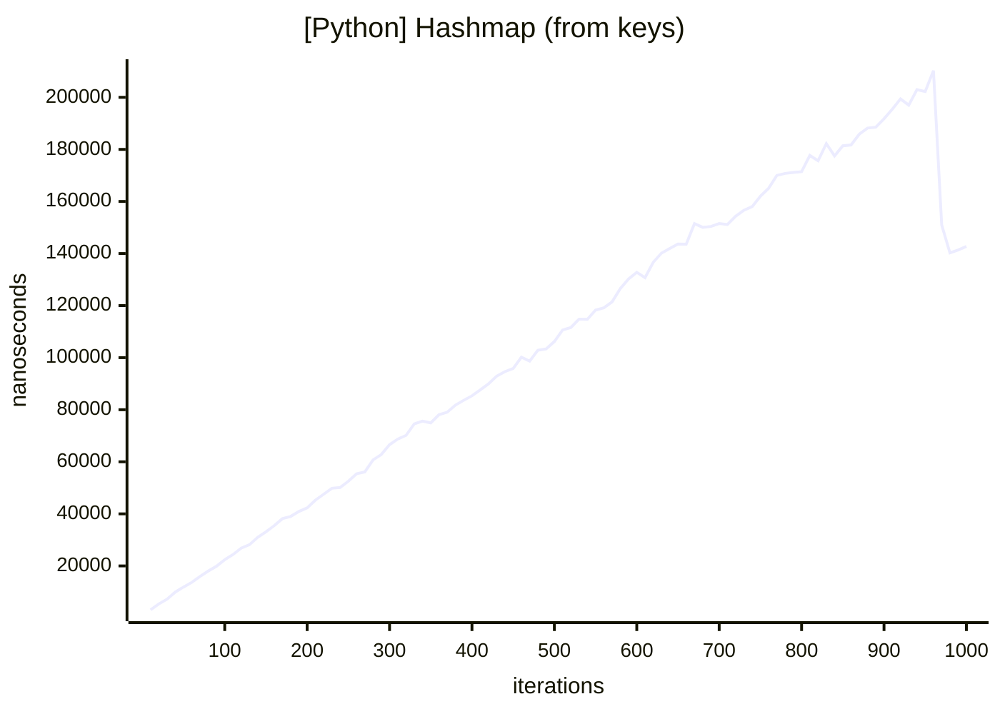
```mermaid
xychart-beta
    title "[Python] Hashmap (from keys)"
    x-axis "iterations" 10 --> 1000
    y-axis "nanoseconds"

    line [3127, 5409, 7229, 9962, 11890, 13690, 15966, 18027, 19891, 22376, 24348, 26813, 28149, 30992, 33092, 35451, 38163, 39006, 40907, 42259, 45271, 47526, 49836, 50105, 52534, 55413, 56097, 60695, 62795, 66580, 68747, 70142, 74579, 75620, 74950, 78104, 79047, 81779, 83628, 85323, 87589, 89925, 92899, 94631, 95826, 100188, 98674, 102842, 103344, 106192, 110640, 111580, 114821, 114733, 118284, 119124, 121433, 126523, 130207, 132764, 130689, 136652, 140162, 141920, 143675, 143606, 151480, 150071, 150396, 151526, 151142, 154332, 156618, 158015, 161981, 165078, 170020, 170785, 171137, 171447, 177672, 175624, 182194, 177501, 181392, 181701, 185824, 188183, 188532, 191768, 195430, 199384, 197024, 202958, 202214, 210275, 150977, 140232, 141372, 142729]
```

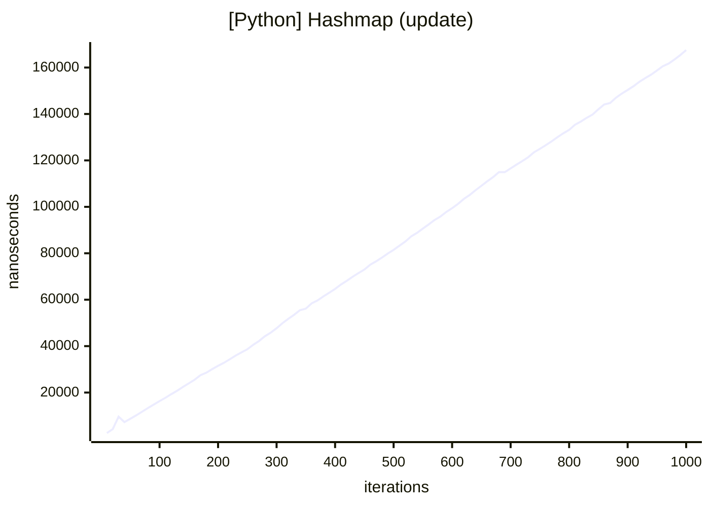
```mermaid
xychart-beta
    title "[Python] Hashmap (update)"
    x-axis "iterations" 10 --> 1000
    y-axis "nanoseconds"

    line [2562, 4247, 9610, 7271, 8684, 10164, 11735, 13310, 14828, 16312, 17743, 19307, 20780, 22434, 23971, 25554, 27500, 28555, 30099, 31502, 32818, 34334, 35929, 37327, 38642, 40552, 42215, 44255, 45810, 47696, 49872, 51739, 53500, 55496, 56131, 58430, 59673, 61409, 63012, 64639, 66522, 68110, 69894, 71474, 72976, 75067, 76511, 78108, 79860, 81460, 83268, 85035, 87274, 88785, 90641, 92442, 94350, 95817, 97802, 99435, 101233, 103387, 105106, 107149, 109045, 110989, 112777, 114953, 114928, 116565, 118166, 119714, 121379, 123507, 124957, 126542, 128203, 129973, 131664, 133142, 135345, 136750, 138332, 139739, 142005, 144093, 144721, 147004, 148765, 150325, 151965, 153837, 155438, 156936, 158705, 160554, 161706, 163447, 165372, 167504]
```

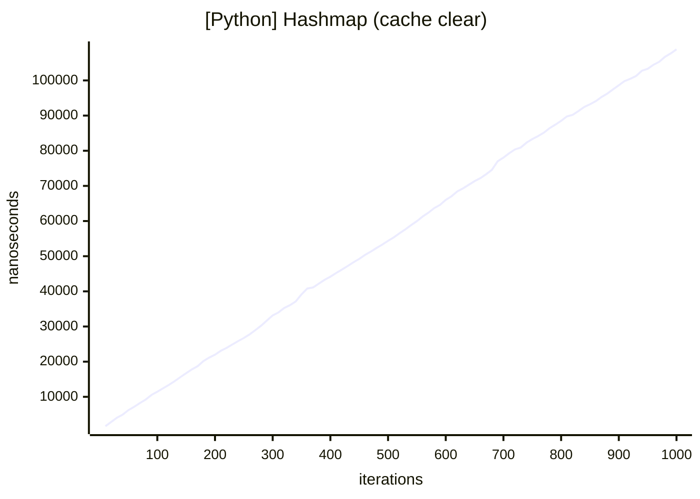
```mermaid
xychart-beta
    title "[Python] Hashmap (cache clear)"
    x-axis "iterations" 10 --> 1000
    y-axis "nanoseconds"

    line [1641, 2854, 4049, 4942, 6232, 7181, 8248, 9234, 10549, 11460, 12422, 13385, 14459, 15604, 16731, 17811, 18720, 20172, 21160, 21975, 23083, 23900, 24881, 25844, 26725, 27765, 28979, 30237, 31703, 33158, 33995, 35258, 36061, 37136, 39150, 40808, 41115, 42197, 43283, 44172, 45226, 46202, 47210, 48264, 49225, 50369, 51295, 52337, 53315, 54362, 55376, 56541, 57629, 58843, 59969, 61294, 62382, 63680, 64590, 66025, 67041, 68430, 69298, 70320, 71345, 72196, 73316, 74577, 77001, 78051, 79295, 80374, 80918, 82301, 83319, 84179, 85129, 86424, 87425, 88500, 89766, 90221, 91287, 92438, 93216, 94086, 95275, 96239, 97456, 98615, 99813, 100469, 101258, 102764, 103299, 104449, 105288, 106707, 107687, 108848]
```

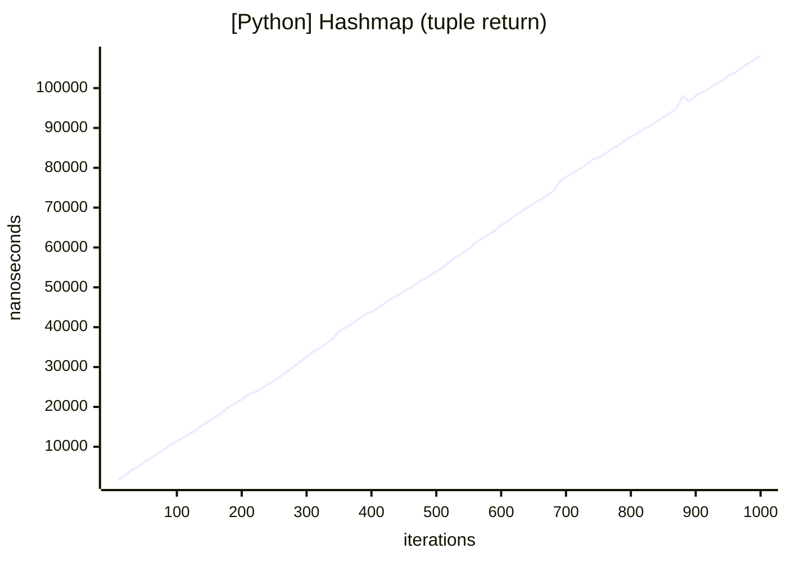
```mermaid
xychart-beta
    title "[Python] Hashmap (tuple return)"
    x-axis "iterations" 10 --> 1000
    y-axis "nanoseconds"

    line [1649, 2751, 4149, 4929, 6222, 7139, 8270, 9184, 10436, 11380, 12318, 13252, 14250, 15452, 16476, 17566, 18566, 20000, 20862, 21841, 23012, 23664, 24601, 25642, 26517, 27709, 28785, 30094, 31316, 32577, 33862, 34738, 35859, 37035, 38936, 39906, 40793, 42055, 43137, 43785, 44836, 45863, 47135, 47894, 49066, 49790, 51034, 51920, 52933, 53970, 54966, 56336, 57606, 58523, 59603, 61153, 62213, 63193, 64183, 65653, 66507, 67879, 68869, 69969, 71031, 71952, 72995, 74078, 76457, 77696, 78630, 79605, 80609, 81989, 82558, 83471, 84667, 85492, 86812, 87798, 88625, 89757, 90573, 91619, 92700, 93660, 94808, 98010, 96693, 98060, 98986, 99776, 101044, 101674, 103104, 103789, 104972, 106088, 107051, 108164]
```
